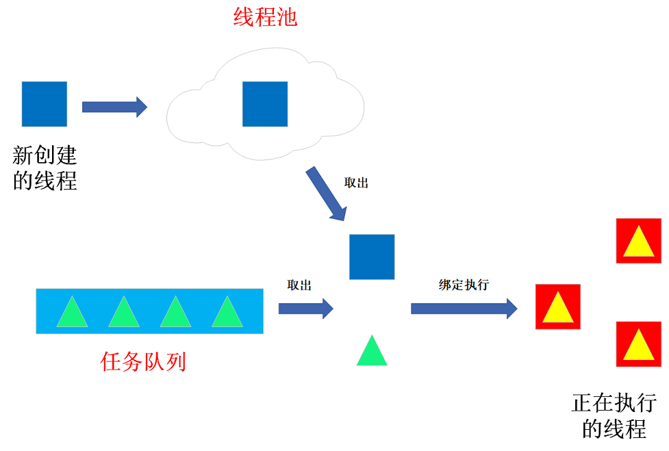

# DynamicThreadPool （动态线程池）

**简介**：本项目基于C++11实现了一个动态线程池。该线程池维护了一个线程队列和一个任务队列，每次取一个任务交付一个空闲线程执行。当无空闲线程时，自动创建新线程。另外，线程池支持自动释放多余的空闲线程。

动态线程池的示意图如下所示：



------

**测试环境**:

```
Ubuntu 22.04
GCC 11.3.0
G++ 11.3.0
```

------

**测试命令**:

```shell
make
./main
```

**某次测试结果**：

```cpp
task create new thread
1 is excuting!!!
create new thread
create new thread
task 7 is excuting!!!
task 3 is excuting!!!
task 4 is excuting!!!
task 5 is excuting!!!
task 6 is excuting!!!
task 2 is excuting!!!
task 8 is excuting!!!
task 14 is excuting!!!
task 15 is excuting!!!
task 16 is excuting!!!
task 17 is excuting!!!
task 18 is excuting!!!
task 19 is excuting!!!
task 20 is excuting!!!
thread stopped
task 11 is excuting!!!
thread stopped
task 12 is excuting!!!
thread stopped
task 13 is excuting!!!
thread stopped
task 9 is excuting!!!
thread stopped
task 10 is excuting!!!
thread stopped
```
